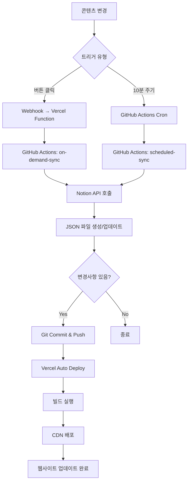

# 기술 요구사항 정의서(TRD): Notion 기반 개인 웹페이지 자동화 솔루션 (v1.0)

| 문서 버전 | 작성일 | 작성자 | 상태 |
| :--- | :--- | :--- | :--- |
| 1.1 | 2025.10.18 | AI Assistant | 최신(Latest) |

---

## 1. 개요 (Overview)

본 문서는 "Notion 기반 개인 웹페이지 자동화 솔루션"의 기술적 구현 세부사항을 정의합니다. PRD v1.8에 명시된 제품 요구사항을 실제 시스템으로 구현하기 위한 아키텍처, 기술 스택, API 설계, 데이터 모델, 워크플로우 등을 상세히 기술합니다.

**주요 변경사항 (v1.2):**
- **사이드바 기반 레이아웃**: 고정 사이드바와 동적 콘텐츠 영역으로 구성된 SPA 스타일 레이아웃
- **통합 데이터베이스 구조**: 모든 페이지(Home, Project, Footer, About 등)를 하나의 Notion 데이터베이스에서 관리
- **PageType 속성 추가**: 페이지 유형을 구분하여 적절한 렌더링 및 라우팅 처리
- **단순화된 동기화**: 단일 DB 스캔으로 모든 페이지 타입 동기화

### 1.1. 문서 목적
- 개발팀이 제품을 구현하기 위한 기술적 가이드 제공
- 시스템 아키텍처 및 컴포넌트 간 상호작용 명확화
- 기술적 의사결정의 근거 문서화
- 개발, 배포, 운영에 필요한 기술 표준 수립

### 1.2. 참조 문서
- PRD v1.8: Notion 기반 개인 웹페이지 자동화 솔루션

---

## 2. 시스템 아키텍처 (System Architecture)

### 2.1. 전체 시스템 구조

```
┌─────────────────────────────────────────────────────────────────┐
│                           사용자 (User)                          │
└────────────────┬────────────────────────────┬───────────────────┘
                 │                            │
                 ▼                            ▼
    ┌───────────────────────┐    ┌───────────────────────┐
    │   Notion Workspace    │    │   Web Browser         │
    │   (CMS)               │    │   (End User)          │
    └───────────┬───────────┘    └───────────┬───────────┘
                │                            │
                │ ① Webhook                  │ ⑥ HTTP Request
                │    (버튼 클릭)              │
                ▼                            ▼
    ┌─────────────────────────────────────────────────────┐
    │              Vercel Platform                         │
    │  ┌─────────────────────┐  ┌──────────────────────┐  │
    │  │ Serverless Function │  │ Static Site          │  │
    │  │ (Webhook Handler)   │  │ (Next.js/Astro)      │  │
    │  └─────────┬───────────┘  └──────────────────────┘  │
    └────────────┼──────────────────────────────────────────┘
                 │ ② GitHub API
                 │    (repository_dispatch)
                 ▼
    ┌─────────────────────────────────────────────────────┐
    │              GitHub Repository                       │
    │  ┌─────────────────────────────────────────────┐    │
    │  │         GitHub Actions Workflows            │    │
    │  │  ┌─────────────────┐  ┌─────────────────┐  │    │
    │  │  │ On-Demand Sync  │  │ Scheduled Sync  │  │    │
    │  │  │ (Webhook 트리거) │  │ (Cron 10분마다) │  │    │
    │  │  └────────┬────────┘  └────────┬────────┘  │    │
    │  └───────────┼─────────────────────┼───────────┘    │
    │              │ ③ Notion API         │ ④ Notion API  │
    │              │    (단일 페이지)      │    (전체 DB)   │
    │              ▼                     ▼                │
    │  ┌─────────────────────────────────────────────┐    │
    │  │         Content Files (data/*.json)         │    │
    │  └─────────────────────────────────────────────┘    │
    │              │ ⑤ Git Commit & Push                  │
    └──────────────┼──────────────────────────────────────┘
                   │
                   ▼
              Vercel Auto Deploy
```

### 2.2. 주요 컴포넌트

#### 2.2.1. Notion Workspace (CMS Layer)
- **역할**: 콘텐츠 작성 및 관리
- **구성요소**:
  - **통합 Database**: 모든 페이지 타입을 하나의 데이터베이스에서 관리
    - Home 페이지 (PageType = "Home")
    - Project 페이지들 (PageType = "Project")
    - Footer 페이지 (PageType = "Footer")
    - About 페이지 (PageType = "About")
  - **Button Block**: 실시간 발행 트리거

#### 2.2.2. Vercel Serverless Functions (Webhook Layer)
- **역할**: Notion 웹훅 수신 및 GitHub Actions 트리거
- **엔드포인트**: `/api/webhook/notion`
- **주요 기능**:
  - Notion 웹훅 페이로드 검증
  - 페이지 ID 추출
  - GitHub repository_dispatch 이벤트 트리거

#### 2.2.3. GitHub Actions (Automation Layer)
- **역할**: 콘텐츠 동기화 및 배포 자동화
- **워크플로우**:
  1. `on-demand-sync.yml`: 웹훅 기반 즉시 발행
  2. `scheduled-sync.yml`: 주기적 전체 동기화 (10분)

#### 2.2.4. Next.js/Astro Application (Presentation Layer)
- **역할**: 정적 웹사이트 생성 및 서빙
- **레이아웃 구조**:
  - **고정 사이드바**: 프로필, 네비게이션 메뉴 (320px 고정)
  - **동적 콘텐츠 영역**: 메뉴 선택에 따라 변경되는 섹션
- **주요 섹션**:
  - Home 섹션 (소개 및 최근 프로젝트)
  - Projects 섹션 (전체 프로젝트 목록)
  - About 섹션 (자기소개)
  - Contact 섹션 (연락처 정보)

### 2.3. 데이터 플로우

#### 2.3.1. 실시간 발행 플로우
```
1. 사용자가 Notion 페이지에서 "🚀 지금 바로 발행하기" 버튼 클릭
   ↓
2. Notion이 Webhook POST 요청 전송
   POST https://your-domain.vercel.app/api/webhook/notion
   Body: { "page_id": "xxx-xxx-xxx" }
   ↓
3. Vercel Function이 요청 수신 및 검증
   - HMAC 서명 검증 (보안)
   - 페이지 ID 추출
   ↓
4. GitHub API 호출 (repository_dispatch)
   POST https://api.github.com/repos/{owner}/{repo}/dispatches
   Body: { "event_type": "notion-webhook", "client_payload": { "page_id": "xxx" } }
   ↓
5. GitHub Actions "on-demand-sync" 워크플로우 실행
   - Notion API로 해당 페이지 데이터 fetch
   - JSON 파일로 저장 (data/pages/{page_id}.json)
   - Git commit & push
   ↓
6. Vercel이 Git push 감지 및 자동 배포
   - 빌드 실행 (next build 또는 astro build)
   - CDN에 배포
   ↓
7. 웹사이트 업데이트 완료 (~1분 이내)
```

#### 2.3.2. 주기적 동기화 플로우
```
1. GitHub Actions Cron 스케줄러 트리거 (매 10분)
   ↓
2. "scheduled-sync" 워크플로우 실행
   ↓
3. Notion API로 전체 데이터베이스 쿼리
   - 최근 수정된 페이지 확인 (last_edited_time)
   - 게시 상태 확인 (Published checkbox)
   ↓
4. 변경사항 감지 및 처리
   - 신규 페이지: 새 JSON 파일 생성
   - 수정된 페이지: 기존 JSON 파일 업데이트
   - 삭제/비공개 페이지: JSON 파일 삭제
   ↓
5. Git commit & push (변경사항이 있는 경우만)
   ↓
6. Vercel 자동 배포
```

---

## 3. 기술 스택 (Technology Stack)

### 3.1. Frontend / Static Site Generator

#### Option 1: Next.js (권장)
```json
{
  "framework": "Next.js 14+",
  "rendering": "Static Site Generation (SSG)",
  "language": "TypeScript",
  "styling": "Tailwind CSS",
  "advantages": [
    "Vercel 최적화 (제로 설정 배포)",
    "ISR (Incremental Static Regeneration) 지원",
    "강력한 TypeScript 지원",
    "풍부한 생태계 및 커뮤니티"
  ]
}
```

**핵심 패키지**:
```json
{
  "dependencies": {
    "next": "^14.0.0",
    "react": "^18.2.0",
    "react-dom": "^18.2.0",
    "@notionhq/client": "^2.2.15",
    "notion-to-md": "^3.1.0"
  },
  "devDependencies": {
    "@types/node": "^20.0.0",
    "@types/react": "^18.2.0",
    "typescript": "^5.3.0",
    "tailwindcss": "^3.4.0",
    "autoprefixer": "^10.4.0",
    "postcss": "^8.4.0"
  }
}
```

#### Option 2: Astro
```json
{
  "framework": "Astro 4+",
  "rendering": "Static Site Generation (SSG)",
  "language": "TypeScript",
  "advantages": [
    "초고속 빌드 및 런타임 성능",
    "Zero JavaScript by default",
    "다양한 UI 프레임워크 통합 가능"
  ]
}
```

### 3.2. Backend / Serverless

```javascript
// Vercel Serverless Functions
{
  "runtime": "Node.js 18.x",
  "region": "iad1", // 서울 리전 (icn1) 또는 동경 (hnd1)
  "maxDuration": 10, // 초 단위
  "memory": 1024 // MB
}
```

### 3.3. CI/CD & Automation

```yaml
# GitHub Actions
runner: "ubuntu-latest"
node_version: "18.x"
secrets_required:
  - NOTION_API_KEY
  - NOTION_DATABASE_ID
  - GITHUB_TOKEN (자동 제공)
```

### 3.4. External APIs & Services

| 서비스 | 용도 | 인증 방식 |
|--------|------|-----------|
| Notion API | 콘텐츠 데이터 가져오기 | Internal Integration Token |
| GitHub API | repository_dispatch 트리거 | Personal Access Token |
| Vercel | 호스팅 및 배포 | Git 기반 자동 배포 |

---

## 4. 데이터 모델 (Data Models)

### 4.1. Notion Database 스키마

#### 통합 Database (모든 페이지 관리)
```typescript
interface NotionUnifiedDatabase {
  // 기본 속성
  Title: {
    type: "title";
    title: Array<RichText>;
    // 예: "나의 첫 프로젝트", "홈", "Footer"
  };
  
  // ★ 페이지 타입 구분 (핵심 속성)
  PageType: {
    type: "select";
    select: {
      name: "Home" | "Project" | "Footer" | "About";
      color: string;
    };
    // Home: 메인 페이지
    // Project: 프로젝트/블로그 게시물
    // Footer: 푸터 컴포넌트
    // About: 소개 페이지
  };
  
  // SEO & URL
  Slug: {
    type: "rich_text";
    rich_text: Array<RichText>;
    // Project: "my-first-project" → /projects/my-first-project
    // Home: "home" (고정)
    // Footer: "footer" (고정)
    // About: "about" (고정)
  };
  
  MetaDescription: {
    type: "rich_text";
    rich_text: Array<RichText>;
    // SEO용 페이지 설명 (최대 160자 권장)
  };
  
  // 게시 상태
  Published: {
    type: "checkbox";
    checkbox: boolean;
    // true: 웹사이트에 게시, false: 비공개
  };
  
  // 분류 (Project 타입에서 주로 사용)
  Category: {
    type: "select";
    select: {
      name: string; // "Web Development" | "Mobile App" | "Design"
      color: string;
    };
  };
  
  // 썸네일 (Project 타입에서 주로 사용)
  Thumbnail: {
    type: "files";
    files: Array<{
      type: "external";
      external: { url: string };
    }>;
  };
  
  // 날짜 (Project 타입에서 주로 사용)
  PublishDate: {
    type: "date";
    date: {
      start: string; // ISO 8601
      end?: string;
    };
  };
  
  // 태그 (Project 타입에서 주로 사용)
  Tags: {
    type: "multi_select";
    multi_select: Array<{
      name: string;
      color: string;
    }>;
  };
}
```

#### 페이지 타입별 속성 활용

| PageType | 필수 속성 | 선택 속성 | 렌더링 위치 |
|----------|-----------|-----------|-------------|
| Home | Title, Published, PageType | MetaDescription, 본문 블록 | `/` (메인 페이지) |
| Project | Title, Slug, Published, PageType | Category, Tags, Thumbnail, PublishDate, MetaDescription | `/projects/{slug}` |
| Footer | Title, Published, PageType | 본문 블록 | 모든 페이지 하단 |
| About | Title, Slug, Published, PageType | MetaDescription, 본문 블록 | `/about` |

### 4.2. Local Data Format (저장소 내 JSON 파일)

#### 개별 페이지 데이터
```typescript
// data/pages/{slug}.json
interface PageData {
  id: string; // Notion 페이지 ID
  pageType: "Home" | "Project" | "Footer" | "About"; // ★ 페이지 타입
  slug: string; // URL slug
  title: string; // 페이지 제목
  metaDescription: string; // SEO 설명
  category: string | null;
  tags: string[];
  thumbnail: string | null; // 이미지 URL
  publishDate: string; // ISO 8601
  lastEditedTime: string; // ISO 8601
  published: boolean;
  
  // Notion 블록을 Markdown으로 변환한 콘텐츠
  content: string; // Markdown 형식
  
  // 원본 블록 데이터 (선택적, 디버깅용)
  blocks?: Array<NotionBlock>;
}
```

**파일명 규칙:**
- Home: `data/pages/home.json`
- Project: `data/pages/{slug}.json` (예: `my-project.json`)
- Footer: `data/pages/footer.json`
- About: `data/pages/about.json`

#### 데이터베이스 인덱스
```typescript
// data/index.json
interface DatabaseIndex {
  lastSyncTime: string; // ISO 8601
  totalPages: number;
  pagesByType: {
    home: PageSummary | null;
    projects: Array<PageSummary>;
    footer: PageSummary | null;
    about: PageSummary | null;
  };
  pages: Array<PageSummary>; // 전체 페이지 목록 (하위 호환성)
}

interface PageSummary {
  id: string;
  pageType: string;
  slug: string;
  title: string;
  category: string | null;
  publishDate: string;
  published: boolean;
}
```

### 4.3. 빌드타임 데이터 처리

```typescript
// lib/notion.ts
import { Client } from "@notionhq/client";
import { NotionToMarkdown } from "notion-to-md";

class NotionService {
  private notion: Client;
  private n2m: NotionToMarkdown;
  
  constructor() {
    this.notion = new Client({ auth: process.env.NOTION_API_KEY });
    this.n2m = new NotionToMarkdown({ notionClient: this.notion });
  }
  
  // 전체 데이터베이스 쿼리
  async queryDatabase(databaseId: string): Promise<PageData[]> {
    const response = await this.notion.databases.query({
      database_id: databaseId,
      filter: {
        property: "Published",
        checkbox: { equals: true }
      },
      sorts: [
        {
          property: "PublishDate",
          direction: "descending"
        }
      ]
    });
    
    return Promise.all(
      response.results.map(page => this.convertPageToData(page))
    );
  }
  
  // 단일 페이지 가져오기
  async getPage(pageId: string): Promise<PageData> {
    const page = await this.notion.pages.retrieve({ page_id: pageId });
    return this.convertPageToData(page);
  }
  
  // Notion 페이지를 PageData로 변환
  private async convertPageToData(page: any): Promise<PageData> {
    const blocks = await this.n2m.pageToMarkdown(page.id);
    const markdown = this.n2m.toMarkdownString(blocks);
    
    const pageType = this.getPropertyValue(page, "PageType");
    let slug = this.getPropertyValue(page, "Slug");
    
    // PageType에 따라 기본 slug 설정
    if (!slug) {
      switch (pageType) {
        case "Home":
          slug = "home";
          break;
        case "Footer":
          slug = "footer";
          break;
        case "About":
          slug = "about";
          break;
        default:
          slug = page.id; // Fallback
      }
    }
    
    return {
      id: page.id,
      pageType: pageType || "Project", // 기본값은 Project
      slug: slug,
      title: this.getPropertyValue(page, "Title"),
      metaDescription: this.getPropertyValue(page, "MetaDescription"),
      category: this.getPropertyValue(page, "Category"),
      tags: this.getPropertyValue(page, "Tags") || [],
      thumbnail: this.getPropertyValue(page, "Thumbnail"),
      publishDate: this.getPropertyValue(page, "PublishDate"),
      lastEditedTime: page.last_edited_time,
      published: this.getPropertyValue(page, "Published"),
      content: markdown.parent
    };
  }
  
  // 속성값 추출 헬퍼
  private getPropertyValue(page: any, propertyName: string): any {
    const property = page.properties[propertyName];
    if (!property) return null;
    
    switch (property.type) {
      case "title":
        return property.title[0]?.plain_text || "";
      case "rich_text":
        return property.rich_text[0]?.plain_text || "";
      case "checkbox":
        return property.checkbox;
      case "select":
        return property.select?.name || null;
      case "multi_select":
        return property.multi_select.map(item => item.name);
      case "date":
        return property.date?.start || null;
      case "files":
        return property.files[0]?.external?.url || 
               property.files[0]?.file?.url || null;
      default:
        return null;
    }
  }
}

export default NotionService;
```

---

## 5. API 설계 (API Design)

### 5.1. Vercel Serverless Function

#### Webhook Endpoint

**파일 위치**: `api/webhook/notion.ts`

```typescript
import { NextApiRequest, NextApiResponse } from "next";
import crypto from "crypto";

interface NotionWebhookPayload {
  page_id: string;
  workspace_id: string;
  timestamp: string;
}

export default async function handler(
  req: NextApiRequest,
  res: NextApiResponse
) {
  // POST 메소드만 허용
  if (req.method !== "POST") {
    return res.status(405).json({ error: "Method not allowed" });
  }
  
  try {
    // 1. 웹훅 서명 검증 (보안)
    const isValid = verifyWebhookSignature(req);
    if (!isValid) {
      return res.status(401).json({ error: "Invalid signature" });
    }
    
    // 2. 페이로드 파싱
    const payload: NotionWebhookPayload = req.body;
    const { page_id } = payload;
    
    if (!page_id) {
      return res.status(400).json({ error: "Missing page_id" });
    }
    
    // 3. GitHub Actions 트리거
    const githubResponse = await triggerGitHubAction(page_id);
    
    if (!githubResponse.ok) {
      throw new Error("Failed to trigger GitHub Action");
    }
    
    // 4. 성공 응답
    return res.status(200).json({
      success: true,
      message: "Deployment triggered",
      page_id: page_id
    });
    
  } catch (error) {
    console.error("Webhook error:", error);
    return res.status(500).json({
      error: "Internal server error",
      details: error.message
    });
  }
}

// 웹훅 서명 검증
function verifyWebhookSignature(req: NextApiRequest): boolean {
  const signature = req.headers["x-notion-signature"] as string;
  const secret = process.env.NOTION_WEBHOOK_SECRET;
  
  if (!signature || !secret) return false;
  
  const body = JSON.stringify(req.body);
  const expectedSignature = crypto
    .createHmac("sha256", secret)
    .update(body)
    .digest("hex");
  
  return crypto.timingSafeEqual(
    Buffer.from(signature),
    Buffer.from(expectedSignature)
  );
}

// GitHub Actions 트리거
async function triggerGitHubAction(pageId: string) {
  const owner = process.env.GITHUB_OWNER; // GitHub username
  const repo = process.env.GITHUB_REPO;   // Repository name
  const token = process.env.GITHUB_TOKEN; // Personal Access Token
  
  return fetch(
    `https://api.github.com/repos/${owner}/${repo}/dispatches`,
    {
      method: "POST",
      headers: {
        "Accept": "application/vnd.github.v3+json",
        "Authorization": `Bearer ${token}`,
        "Content-Type": "application/json"
      },
      body: JSON.stringify({
        event_type: "notion-webhook",
        client_payload: {
          page_id: pageId,
          timestamp: new Date().toISOString()
        }
      })
    }
  );
}
```

### 5.2. Notion API 사용

#### Rate Limits & Best Practices

```typescript
// Notion API 제한사항
const NOTION_RATE_LIMITS = {
  requestsPerSecond: 3,
  averageRequestsPerMinute: 60
};

// 재시도 로직 구현
async function notionApiWithRetry(
  apiCall: () => Promise<any>,
  maxRetries: number = 3
): Promise<any> {
  for (let i = 0; i < maxRetries; i++) {
    try {
      return await apiCall();
    } catch (error) {
      if (error.code === "rate_limited" && i < maxRetries - 1) {
        const waitTime = Math.pow(2, i) * 1000; // Exponential backoff
        await new Promise(resolve => setTimeout(resolve, waitTime));
        continue;
      }
      throw error;
    }
  }
}
```

#### API 호출 최적화

```typescript
// 병렬 처리로 속도 향상
async function fetchAllPages(pageIds: string[]): Promise<PageData[]> {
  // 한 번에 5개씩만 처리 (Rate limit 고려)
  const batchSize = 5;
  const results: PageData[] = [];
  
  for (let i = 0; i < pageIds.length; i += batchSize) {
    const batch = pageIds.slice(i, i + batchSize);
    const batchResults = await Promise.all(
      batch.map(id => notionService.getPage(id))
    );
    results.push(...batchResults);
    
    // Rate limit 준수를 위한 대기
    if (i + batchSize < pageIds.length) {
      await new Promise(resolve => setTimeout(resolve, 1000));
    }
  }
  
  return results;
}
```

---

## 6. GitHub Actions 워크플로우 (Workflows)

### 6.1. On-Demand Sync Workflow

**파일 위치**: `.github/workflows/on-demand-sync.yml`

```yaml
name: On-Demand Notion Sync

on:
  repository_dispatch:
    types: [notion-webhook]

jobs:
  sync-page:
    runs-on: ubuntu-latest
    
    steps:
      - name: Checkout repository
        uses: actions/checkout@v4
        with:
          token: ${{ secrets.GITHUB_TOKEN }}
      
      - name: Setup Node.js
        uses: actions/setup-node@v4
        with:
          node-version: '18'
          cache: 'npm'
      
      - name: Install dependencies
        run: npm ci
      
      - name: Fetch single page from Notion
        env:
          NOTION_API_KEY: ${{ secrets.NOTION_API_KEY }}
          PAGE_ID: ${{ github.event.client_payload.page_id }}
        run: |
          node scripts/sync-single-page.js
      
      - name: Check for changes
        id: git-check
        run: |
          git diff --exit-code || echo "has_changes=true" >> $GITHUB_OUTPUT
      
      - name: Commit and push changes
        if: steps.git-check.outputs.has_changes == 'true'
        run: |
          git config user.name "GitHub Actions Bot"
          git config user.email "actions@github.com"
          git add data/
          git commit -m "Update page: ${{ github.event.client_payload.page_id }}"
          git push
      
      - name: Notify completion
        if: success()
        run: |
          echo "✅ Page updated successfully"
          echo "Page ID: ${{ github.event.client_payload.page_id }}"
          echo "Timestamp: ${{ github.event.client_payload.timestamp }}"
```

### 6.2. Scheduled Sync Workflow

**파일 위치**: `.github/workflows/scheduled-sync.yml`

```yaml
name: Scheduled Notion Sync

on:
  schedule:
    # 매 10분마다 실행 (UTC 기준)
    - cron: '*/10 * * * *'
  workflow_dispatch: # 수동 실행 허용

jobs:
  sync-all:
    runs-on: ubuntu-latest
    timeout-minutes: 15
    
    steps:
      - name: Checkout repository
        uses: actions/checkout@v4
        with:
          token: ${{ secrets.GITHUB_TOKEN }}
      
      - name: Setup Node.js
        uses: actions/setup-node@v4
        with:
          node-version: '18'
          cache: 'npm'
      
      - name: Install dependencies
        run: npm ci
      
      - name: Sync all pages from Notion
        env:
          NOTION_API_KEY: ${{ secrets.NOTION_API_KEY }}
          NOTION_DATABASE_ID: ${{ secrets.NOTION_DATABASE_ID }}
        run: |
          node scripts/sync-all-pages.js
        # ★ 변경사항: Footer도 동일한 DB에 있으므로 별도 동기화 불필요
      
      - name: Check for changes
        id: git-check
        run: |
          if [[ -n $(git status --porcelain) ]]; then
            echo "has_changes=true" >> $GITHUB_OUTPUT
          else
            echo "has_changes=false" >> $GITHUB_OUTPUT
          fi
      
      - name: Commit and push changes
        if: steps.git-check.outputs.has_changes == 'true'
        run: |
          git config user.name "GitHub Actions Bot"
          git config user.email "actions@github.com"
          git add data/
          git commit -m "Scheduled sync: $(date +'%Y-%m-%d %H:%M:%S')"
          git push
      
      - name: Report sync results
        run: |
          if [[ "${{ steps.git-check.outputs.has_changes }}" == "true" ]]; then
            echo "✅ Sync completed with changes"
          else
            echo "ℹ️ No changes detected"
          fi
```

### 6.3. Sync Scripts

#### 단일 페이지 동기화

**파일 위치**: `scripts/sync-single-page.js`

```javascript
const fs = require('fs').promises;
const path = require('path');
const NotionService = require('../lib/notion');

async function syncSinglePage() {
  const pageId = process.env.PAGE_ID;
  
  if (!pageId) {
    console.error('❌ PAGE_ID environment variable is required');
    process.exit(1);
  }
  
  console.log(`📄 Fetching page: ${pageId}`);
  
  try {
    const notionService = new NotionService();
    const pageData = await notionService.getPage(pageId);
    
    // Published가 false면 파일 삭제
    const filePath = path.join(
      process.cwd(),
      'data',
      'pages',
      `${pageData.slug}.json`
    );
    
    if (!pageData.published) {
      console.log('🗑️  Page is unpublished, removing file');
      try {
        await fs.unlink(filePath);
        console.log('✅ File removed');
      } catch (error) {
        if (error.code !== 'ENOENT') throw error;
        console.log('ℹ️  File already removed');
      }
      return;
    }
    
    // JSON 파일로 저장
    await fs.mkdir(path.dirname(filePath), { recursive: true });
    await fs.writeFile(
      filePath,
      JSON.stringify(pageData, null, 2),
      'utf-8'
    );
    
    console.log(`✅ Page synced: ${pageData.title}`);
    console.log(`   Slug: ${pageData.slug}`);
    console.log(`   Category: ${pageData.category}`);
    
  } catch (error) {
    console.error('❌ Sync failed:', error.message);
    process.exit(1);
  }
}

syncSinglePage();
```

#### 전체 동기화

**파일 위치**: `scripts/sync-all-pages.js`

```javascript
const fs = require('fs').promises;
const path = require('path');
const NotionService = require('../lib/notion');

async function syncAllPages() {
  const databaseId = process.env.NOTION_DATABASE_ID;
  
  if (!databaseId) {
    console.error('❌ NOTION_DATABASE_ID is required');
    process.exit(1);
  }
  
  console.log('🔄 Starting full database sync...');
  
  try {
    const notionService = new NotionService();
    
    // 1. Notion에서 모든 페이지 가져오기
    const pages = await notionService.queryDatabase(databaseId);
    console.log(`📚 Found ${pages.length} published pages`);
    
    // 2. 각 페이지를 JSON 파일로 저장
    const dataDir = path.join(process.cwd(), 'data', 'pages');
    await fs.mkdir(dataDir, { recursive: true });
    
    const savedSlugs = new Set();
    
    for (const page of pages) {
      const filePath = path.join(dataDir, `${page.slug}.json`);
      await fs.writeFile(
        filePath,
        JSON.stringify(page, null, 2),
        'utf-8'
      );
      savedSlugs.add(page.slug);
      console.log(`  ✅ ${page.title}`);
    }
    
    // 3. 로컬에는 있지만 Notion에는 없는 파일 삭제
    const existingFiles = await fs.readdir(dataDir);
    for (const file of existingFiles) {
      if (!file.endsWith('.json')) continue;
      
      const slug = file.replace('.json', '');
      if (!savedSlugs.has(slug)) {
        await fs.unlink(path.join(dataDir, file));
        console.log(`  🗑️  Removed: ${file}`);
      }
    }
    
    // 4. 인덱스 파일 생성 (페이지 타입별로 분류)
    const pagesByType = {
      home: pages.find(p => p.pageType === 'Home') || null,
      projects: pages.filter(p => p.pageType === 'Project'),
      footer: pages.find(p => p.pageType === 'Footer') || null,
      about: pages.find(p => p.pageType === 'About') || null
    };
    
    const index = {
      lastSyncTime: new Date().toISOString(),
      totalPages: pages.length,
      pagesByType: {
        home: pagesByType.home ? {
          id: pagesByType.home.id,
          pageType: pagesByType.home.pageType,
          slug: pagesByType.home.slug,
          title: pagesByType.home.title,
          category: null,
          publishDate: pagesByType.home.publishDate,
          published: pagesByType.home.published
        } : null,
        projects: pagesByType.projects.map(p => ({
          id: p.id,
          pageType: p.pageType,
          slug: p.slug,
          title: p.title,
          category: p.category,
          publishDate: p.publishDate,
          published: p.published
        })),
        footer: pagesByType.footer ? {
          id: pagesByType.footer.id,
          pageType: pagesByType.footer.pageType,
          slug: pagesByType.footer.slug,
          title: pagesByType.footer.title,
          category: null,
          publishDate: pagesByType.footer.publishDate,
          published: pagesByType.footer.published
        } : null,
        about: pagesByType.about ? {
          id: pagesByType.about.id,
          pageType: pagesByType.about.pageType,
          slug: pagesByType.about.slug,
          title: pagesByType.about.title,
          category: null,
          publishDate: pagesByType.about.publishDate,
          published: pagesByType.about.published
        } : null
      },
      pages: pages.map(p => ({
        id: p.id,
        pageType: p.pageType,
        slug: p.slug,
        title: p.title,
        category: p.category,
        publishDate: p.publishDate,
        published: p.published
      }))
    };
    
    await fs.writeFile(
      path.join(process.cwd(), 'data', 'index.json'),
      JSON.stringify(index, null, 2),
      'utf-8'
    );
    
    console.log('✅ Full sync completed');
    console.log(`   Home: ${pagesByType.home ? '✓' : '✗'}`);
    console.log(`   Projects: ${pagesByType.projects.length}`);
    console.log(`   Footer: ${pagesByType.footer ? '✓' : '✗'}`);
    console.log(`   About: ${pagesByType.about ? '✓' : '✗'}`);
    
  } catch (error) {
    console.error('❌ Sync failed:', error.message);
    console.error(error.stack);
    process.exit(1);
  }
}

syncAllPages();
```

**★ 변경사항:** Footer는 이제 메인 데이터베이스의 일부이므로 별도의 동기화 스크립트가 필요하지 않습니다. `sync-all-pages.js`에서 `PageType = "Footer"`인 페이지를 자동으로 처리합니다.

---

## 7. 프론트엔드 구현 (Frontend Implementation)

### 7.1. Next.js 프로젝트 구조

```
notion-portfolio/
├── public/
│   ├── favicon.ico
│   ├── profile.jpg             # 프로필 이미지
│   └── images/
├── src/
│   ├── app/                    # App Router (Next.js 14+)
│   │   ├── layout.tsx          # 루트 레이아웃
│   │   ├── page.tsx            # 메인 페이지 (MainLayout 렌더링)
│   │   ├── projects/           # 프로젝트 상세 (선택적)
│   │   │   └── [slug]/
│   │   │       └── page.tsx    # 프로젝트 상세 (/projects/[slug])
│   │   └── globals.css
│   ├── components/
│   │   ├── Sidebar.tsx         # 사이드바 컴포넌트
│   │   ├── MainLayout.tsx      # 메인 레이아웃 (사이드바 + 콘텐츠)
│   │   ├── sections/           # 섹션 컴포넌트
│   │   │   ├── HomeSection.tsx
│   │   │   ├── ProjectsSection.tsx
│   │   │   ├── AboutSection.tsx
│   │   │   └── ContactSection.tsx
│   │   ├── ProjectCard.tsx
│   │   └── MarkdownRenderer.tsx
│   ├── lib/
│   │   ├── notion.ts           # Notion API 래퍼
│   │   └── data.ts             # 로컬 데이터 로더
│   └── types/
│       └── index.ts
├── data/                       # 동기화된 Notion 데이터
│   ├── index.json
│   └── pages/
│       ├── home.json
│       ├── footer.json
│       ├── about.json
│       └── [project-slug].json
├── scripts/                    # 동기화 스크립트
├── .github/
│   └── workflows/
└── package.json
```

### 7.2. 페이지 컴포넌트

#### 메인 페이지

**파일 위치**: `src/app/page.tsx`

```typescript
import fs from 'fs/promises';
import path from 'path';
import ProjectCard from '@/components/ProjectCard';
import { PageData, DatabaseIndex } from '@/types';

export const dynamic = 'force-static';

async function getHomeData(): Promise<PageData | null> {
  try {
    const homePath = path.join(process.cwd(), 'data', 'pages', 'home.json');
    const homeData = await fs.readFile(homePath, 'utf-8');
    return JSON.parse(homeData) as PageData;
  } catch {
    return null;
  }
}

async function getProjects(): Promise<PageData[]> {
  const indexPath = path.join(process.cwd(), 'data', 'index.json');
  const indexData = await fs.readFile(indexPath, 'utf-8');
  const index: DatabaseIndex = JSON.parse(indexData);
  
  // Project 타입만 필터링
  const projectSummaries = index.pagesByType?.projects || 
    index.pages.filter(p => p.pageType === 'Project');
  
  // 각 프로젝트 데이터 로드
  const projects = await Promise.all(
    projectSummaries.map(async (item) => {
      const pagePath = path.join(
        process.cwd(),
        'data',
        'pages',
        `${item.slug}.json`
      );
      const pageData = await fs.readFile(pagePath, 'utf-8');
      return JSON.parse(pageData) as PageData;
    })
  );
  
  // 날짜순 정렬
  return projects.sort((a, b) => 
    new Date(b.publishDate).getTime() - new Date(a.publishDate).getTime()
  );
}

export default function HomePage() {
  return <MainLayout />;
}

// MainLayout 컴포넌트는 클라이언트 컴포넌트로 구현
// src/components/MainLayout.tsx 참조
```

**사이드바 기반 레이아웃 구조**:

```typescript
// src/components/MainLayout.tsx
'use client';

import { useState } from 'react';
import { Sidebar } from '@/components/Sidebar';
import { HomeSection } from '@/components/sections/HomeSection';
import { ProjectsSection } from '@/components/sections/ProjectsSection';
import { AboutSection } from '@/components/sections/AboutSection';
import { ContactSection } from '@/components/sections/ContactSection';

export function MainLayout() {
  const [activeSection, setActiveSection] = useState('home');

  const renderActiveSection = () => {
    switch (activeSection) {
      case 'home':
        return <HomeSection />;
      case 'projects':
        return <ProjectsSection />;
      case 'about':
        return <AboutSection />;
      case 'contact':
        return <ContactSection />;
      default:
        return <HomeSection />;
    }
  };

  return (
    <div className="flex min-h-screen bg-white">
      <Sidebar 
        activeSection={activeSection} 
        onSectionChange={setActiveSection} 
      />
      
      {/* 메인 콘텐츠 영역 */}
      <main className="flex-1 ml-0 md:ml-80 pt-16 md:pt-0">
        <div className="p-4 md:p-8">
          {renderActiveSection()}
        </div>
      </main>
    </div>
  );
}
```

#### 프로젝트 상세 페이지

**파일 위치**: `src/app/projects/[slug]/page.tsx`

```typescript
import fs from 'fs/promises';
import path from 'path';
import { notFound } from 'next/navigation';
import MarkdownRenderer from '@/components/MarkdownRenderer';
import { PageData, DatabaseIndex } from '@/types';

export const dynamic = 'force-static';

interface PageProps {
  params: { slug: string };
}

async function getProject(slug: string): Promise<PageData | null> {
  try {
    const pagePath = path.join(
      process.cwd(),
      'data',
      'pages',
      `${slug}.json`
    );
    const pageData = await fs.readFile(pagePath, 'utf-8');
    return JSON.parse(pageData);
  } catch {
    return null;
  }
}

export default async function ProjectPage({ params }: PageProps) {
  const project = await getProject(params.slug);
  
  if (!project) {
    notFound();
  }
  
  return (
    <article className="container mx-auto px-4 py-12 max-w-4xl">
      {/* 헤더 */}
      <header className="mb-12">
        {project.thumbnail && (
          
        )}
        
        <div className="flex items-center gap-4 text-sm text-gray-600 mb-4">
          <time dateTime={project.publishDate}>
            {new Date(project.publishDate).toLocaleDateString('ko-KR')}
          </time>
          {project.category && (
            <span className="px-3 py-1 bg-blue-100 text-blue-800 rounded-full">
              {project.category}
            </span>
          )}
        </div>
        
        <h1 className="text-5xl font-bold mb-4">{project.title}</h1>
        
        {project.metaDescription && (
          <p className="text-xl text-gray-600">{project.metaDescription}</p>
        )}
        
        {project.tags.length > 0 && (
          <div className="flex gap-2 mt-4">
            {project.tags.map(tag => (
              <span
                key={tag}
                className="px-2 py-1 bg-gray-100 text-gray-700 text-sm rounded"
              >
                #{tag}
              </span>
            ))}
          </div>
        )}
      </header>
      
      {/* 본문 */}
      <MarkdownRenderer content={project.content} />
      
      {/* 네비게이션 */}
      <nav className="mt-16 pt-8 border-t">
        <a
          href="/"
          className="text-blue-600 hover:text-blue-800 font-medium"
        >
          ← 목록으로 돌아가기
        </a>
      </nav>
    </article>
  );
}

// 정적 경로 생성
export async function generateStaticParams() {
  const indexPath = path.join(process.cwd(), 'data', 'index.json');
  const indexData = await fs.readFile(indexPath, 'utf-8');
  const index: DatabaseIndex = JSON.parse(indexData);
  
  return index.pages.map(page => ({
    slug: page.slug
  }));
}

// 메타데이터
export async function generateMetadata({ params }: PageProps) {
  const project = await getProject(params.slug);
  
  if (!project) {
    return {};
  }
  
  return {
    title: project.title,
    description: project.metaDescription,
    openGraph: {
      title: project.title,
      description: project.metaDescription,
      images: project.thumbnail ? [project.thumbnail] : [],
    },
  };
}
```

### 7.3. 공통 컴포넌트

#### ProjectCard 컴포넌트

**파일 위치**: `src/components/ProjectCard.tsx`

```typescript
import Link from 'next/link';
import { PageData } from '@/types';

interface ProjectCardProps {
  project: PageData;
}

export default function ProjectCard({ project }: ProjectCardProps) {
  return (
    <Link
      href={`/projects/${project.slug}`}
      className="group block bg-white rounded-lg shadow-md hover:shadow-xl transition-shadow overflow-hidden"
    >
      {project.thumbnail && (
        <div className="aspect-video overflow-hidden">
          
        </div>
      )}
      
      <div className="p-6">
        {project.category && (
          <span className="text-sm text-blue-600 font-medium">
            {project.category}
          </span>
        )}
        
        <h3 className="text-xl font-bold mt-2 mb-3 group-hover:text-blue-600 transition-colors">
          {project.title}
        </h3>
        
        {project.metaDescription && (
          <p className="text-gray-600 line-clamp-3 mb-4">
            {project.metaDescription}
          </p>
        )}
        
        <div className="flex items-center justify-between text-sm">
          <time className="text-gray-500">
            {new Date(project.publishDate).toLocaleDateString('ko-KR')}
          </time>
          
          <span className="text-blue-600 group-hover:underline">
            자세히 보기 →
          </span>
        </div>
      </div>
    </Link>
  );
}
```

#### Footer 컴포넌트

**파일 위치**: `src/components/Footer.tsx`

```typescript
import fs from 'fs/promises';
import path from 'path';
import MarkdownRenderer from './MarkdownRenderer';
import { PageData } from '@/types';

async function getFooterData(): Promise<PageData | null> {
  try {
    // ★ 변경: footer.json 파일에서 직접 로드 (PageType = "Footer")
    const footerPath = path.join(
      process.cwd(),
      'data',
      'pages',
      'footer.json'
    );
    const data = await fs.readFile(footerPath, 'utf-8');
    return JSON.parse(data) as PageData;
  } catch {
    return null;
  }
}

export default async function Footer() {
  const footerData = await getFooterData();
  
  return (
    <footer className="bg-gray-900 text-white mt-20">
      <div className="container mx-auto px-4 py-12">
        {footerData ? (
          <div className="prose prose-invert max-w-none">
            <MarkdownRenderer content={footerData.content} />
          </div>
        ) : (
          <div className="text-center">
            <p>© {new Date().getFullYear()} All rights reserved.</p>
          </div>
        )}
      </div>
    </footer>
  );
}
```

#### Markdown 렌더러

**파일 위치**: `src/components/MarkdownRenderer.tsx`

```typescript
'use client';

import ReactMarkdown from 'react-markdown';
import remarkGfm from 'remark-gfm';
import { Prism as SyntaxHighlighter } from 'react-syntax-highlighter';
import { oneDark } from 'react-syntax-highlighter/dist/cjs/styles/prism';

interface MarkdownRendererProps {
  content: string;
}

export default function MarkdownRenderer({ content }: MarkdownRendererProps) {
  return (
    <div className="prose prose-lg max-w-none">
      <ReactMarkdown
        remarkPlugins={[remarkGfm]}
        components={{
          code({ node, inline, className, children, ...props }) {
            const match = /language-(\w+)/.exec(className || '');
            return !inline && match ? (
              <SyntaxHighlighter
                style={oneDark as any}
                language={match[1]}
                PreTag="div"
                {...props}
              >
                {String(children).replace(/\n$/, '')}
              </SyntaxHighlighter>
            ) : (
              <code className={className} {...props}>
                {children}
              </code>
            );
          },
          img({ src, alt }) {
            return (
              
            );
          },
          a({ href, children }) {
            const isExternal = href?.startsWith('http');
            return (
              <a
                href={href}
                target={isExternal ? '_blank' : undefined}
                rel={isExternal ? 'noopener noreferrer' : undefined}
                className="text-blue-600 hover:text-blue-800 underline"
              >
                {children}
              </a>
            );
          }
        }}
      >
        {content}
      </ReactMarkdown>
    </div>
  );
}
```

### 7.4. TypeScript 타입 정의

**파일 위치**: `src/types/index.ts`

```typescript
export type PageType = "Home" | "Project" | "Footer" | "About";

export interface PageData {
  id: string;
  pageType: PageType; // ★ 추가
  slug: string;
  title: string;
  metaDescription: string;
  category: string | null;
  tags: string[];
  thumbnail: string | null;
  publishDate: string;
  lastEditedTime: string;
  published: boolean;
  content: string;
}

export interface PageSummary {
  id: string;
  pageType: PageType; // ★ 추가
  slug: string;
  title: string;
  category: string | null;
  publishDate: string;
  published: boolean;
}

export interface DatabaseIndex {
  lastSyncTime: string;
  totalPages: number;
  pagesByType: { // ★ 추가
    home: PageSummary | null;
    projects: Array<PageSummary>;
    footer: PageSummary | null;
    about: PageSummary | null;
  };
  pages: Array<PageSummary>; // 전체 페이지 목록 (하위 호환성)
}
```

---

## 8. 보안 (Security)

### 8.1. 환경 변수 관리

#### GitHub Secrets 설정

```bash
# Repository Settings > Secrets and variables > Actions

# Notion API 키
NOTION_API_KEY=secret_xxxxxxxxxxxx

# Notion 데이터베이스 ID (통합 DB - 모든 페이지 포함)
NOTION_DATABASE_ID=xxxxxxxxxxxxxxxxxxxxxxxxxxxxxxxx

# GitHub 토큰 (자동 제공, 필요시 PAT로 대체)
GITHUB_TOKEN=ghp_xxxxxxxxxxxx

# Webhook 서명 검증용 시크릿
NOTION_WEBHOOK_SECRET=your-random-secret-string

# GitHub 저장소 정보
GITHUB_OWNER=your-username
GITHUB_REPO=notion-portfolio
```

#### Vercel Environment Variables

```bash
# Vercel Dashboard > Project Settings > Environment Variables

# Production 환경
NOTION_API_KEY=secret_xxxxxxxxxxxx
NOTION_WEBHOOK_SECRET=your-random-secret-string
GITHUB_TOKEN=ghp_xxxxxxxxxxxx
GITHUB_OWNER=your-username
GITHUB_REPO=notion-portfolio
```

### 8.2. Webhook 보안

#### HMAC 서명 검증

```typescript
// Notion Webhook 설정 시 Secret 생성
const generateWebhookSecret = () => {
  return crypto.randomBytes(32).toString('hex');
};

// Notion 측에서 요청 시 서명 추가
// X-Notion-Signature: hmac-sha256(secret, request_body)

// 서버에서 검증
function verifyWebhookSignature(
  receivedSignature: string,
  body: string,
  secret: string
): boolean {
  const expectedSignature = crypto
    .createHmac('sha256', secret)
    .update(body)
    .digest('hex');
  
  // Timing attack 방지
  return crypto.timingSafeEqual(
    Buffer.from(receivedSignature),
    Buffer.from(expectedSignature)
  );
}
```

#### Rate Limiting

```typescript
// Vercel Serverless Function에서 Rate Limiting
import rateLimit from 'express-rate-limit';

const limiter = rateLimit({
  windowMs: 1 * 60 * 1000, // 1분
  max: 10, // 최대 10회
  message: 'Too many requests, please try again later.'
});

// 또는 Vercel Edge Config 활용
```

### 8.3. API 키 권한 최소화

```javascript
// Notion Integration 권한 설정
{
  "capabilities": {
    "read_content": true,    // 콘텐츠 읽기만 필요
    "update_content": false, // 수정 불필요
    "insert_content": false  // 생성 불필요
  },
  "content_spaces": [
    "specific_database_id" // 특정 DB만 접근
  ]
}

// GitHub Token 권한
{
  "scopes": [
    "repo",           // 저장소 접근
    "workflow"        // Actions 트리거
  ]
}
```

---

## 9. 에러 핸들링 및 로깅 (Error Handling & Logging)

### 9.1. 에러 처리 전략

```typescript
// lib/errors.ts
export class NotionApiError extends Error {
  constructor(
    message: string,
    public statusCode: number,
    public code: string
  ) {
    super(message);
    this.name = 'NotionApiError';
  }
}

export class SyncError extends Error {
  constructor(
    message: string,
    public pageId?: string
  ) {
    super(message);
    this.name = 'SyncError';
  }
}

// 에러 핸들러
export function handleError(error: unknown): void {
  if (error instanceof NotionApiError) {
    console.error('Notion API Error:', {
      message: error.message,
      statusCode: error.statusCode,
      code: error.code
    });
    
    if (error.statusCode === 429) {
      console.error('Rate limited. Please wait before retrying.');
    }
  } else if (error instanceof SyncError) {
    console.error('Sync Error:', {
      message: error.message,
      pageId: error.pageId
    });
  } else {
    console.error('Unknown Error:', error);
  }
}
```

### 9.2. 로깅 구조

```typescript
// lib/logger.ts
enum LogLevel {
  DEBUG = 'DEBUG',
  INFO = 'INFO',
  WARN = 'WARN',
  ERROR = 'ERROR'
}

interface LogEntry {
  timestamp: string;
  level: LogLevel;
  message: string;
  context?: Record<string, any>;
}

class Logger {
  private log(level: LogLevel, message: string, context?: any) {
    const entry: LogEntry = {
      timestamp: new Date().toISOString(),
      level,
      message,
      context
    };
    
    const output = JSON.stringify(entry);
    
    switch (level) {
      case LogLevel.ERROR:
        console.error(output);
        break;
      case LogLevel.WARN:
        console.warn(output);
        break;
      default:
        console.log(output);
    }
  }
  
  debug(message: string, context?: any) {
    this.log(LogLevel.DEBUG, message, context);
  }
  
  info(message: string, context?: any) {
    this.log(LogLevel.INFO, message, context);
  }
  
  warn(message: string, context?: any) {
    this.log(LogLevel.WARN, message, context);
  }
  
  error(message: string, error?: Error, context?: any) {
    this.log(LogLevel.ERROR, message, {
      ...context,
      error: error ? {
        name: error.name,
        message: error.message,
        stack: error.stack
      } : undefined
    });
  }
}

export const logger = new Logger();
```

### 9.3. GitHub Actions 로깅

```yaml
# 워크플로우 내 로깅 예시
- name: Sync pages with detailed logging
  env:
    NOTION_API_KEY: ${{ secrets.NOTION_API_KEY }}
  run: |
    node scripts/sync-all-pages.js 2>&1 | tee sync.log
  continue-on-error: false

- name: Upload logs on failure
  if: failure()
  uses: actions/upload-artifact@v3
  with:
    name: sync-logs
    path: sync.log
    retention-days: 7
```

### 9.4. 알림 시스템

```yaml
# .github/workflows/scheduled-sync.yml에 추가
- name: Notify on failure
  if: failure()
  uses: 8398a7/action-slack@v3
  with:
    status: ${{ job.status }}
    text: 'Notion sync failed'
    webhook_url: ${{ secrets.SLACK_WEBHOOK_URL }}

# 또는 GitHub Issues 자동 생성
- name: Create issue on failure
  if: failure()
  uses: actions/github-script@v7
  with:
    script: |
      github.rest.issues.create({
        owner: context.repo.owner,
        repo: context.repo.repo,
        title: 'Sync failed on ${{ github.sha }}',
        body: 'Please check the workflow logs.',
        labels: ['bug', 'automated']
      })
```

---

## 10. 성능 최적화 (Performance Optimization)

### 10.1. 빌드 최적화

```javascript
// next.config.js
module.exports = {
  output: 'export', // 정적 내보내기
  
  // 이미지 최적화
  images: {
    unoptimized: false,
    domains: ['s3.us-west-2.amazonaws.com'], // Notion 이미지
    deviceSizes: [640, 750, 828, 1080, 1200],
    imageSizes: [16, 32, 48, 64, 96],
  },
  
  // 압축
  compress: true,
  
  // 불필요한 빌드 제외
  pageExtensions: ['tsx', 'ts'],
  
  // 캐싱 최적화
  generateBuildId: async () => {
    return process.env.GIT_COMMIT_SHA || 'development';
  },
};
```

### 10.2. 증분 빌드 (Incremental Build)

```typescript
// 변경된 페이지만 리빌드
// scripts/incremental-build.js

const fs = require('fs').promises;
const path = require('path');
const { execSync } = require('child_process');

async function getChangedFiles() {
  const diff = execSync('git diff --name-only HEAD~1')
    .toString()
    .split('\n')
    .filter(Boolean);
  
  return diff.filter(file => file.startsWith('data/pages/'));
}

async function incrementalBuild() {
  const changedFiles = await getChangedFiles();
  
  if (changedFiles.length === 0) {
    console.log('No page changes detected, skipping build');
    process.exit(0);
  }
  
  console.log(`Changed pages: ${changedFiles.length}`);
  changedFiles.forEach(file => console.log(`  - ${file}`));
  
  // Next.js는 자동으로 증분 빌드 수행
  execSync('npm run build', { stdio: 'inherit' });
}

incrementalBuild();
```

### 10.3. 캐싱 전략

```typescript
// Notion API 응답 캐싱 (GitHub Actions 캐시 활용)
// .github/workflows/scheduled-sync.yml

- name: Cache Notion data
  uses: actions/cache@v3
  with:
    path: |
      data/
      .notion-cache/
    key: notion-data-${{ hashFiles('data/index.json') }}
    restore-keys: |
      notion-data-

// 변경 감지 최적화
- name: Check if rebuild needed
  id: check-rebuild
  run: |
    if git diff --quiet HEAD~1 -- data/; then
      echo "needs_rebuild=false" >> $GITHUB_OUTPUT
    else
      echo "needs_rebuild=true" >> $GITHUB_OUTPUT
    fi

- name: Build site
  if: steps.check-rebuild.outputs.needs_rebuild == 'true'
  run: npm run build
```

### 10.4. Vercel 배포 최적화

```json
// vercel.json
{
  "buildCommand": "npm run build",
  "devCommand": "npm run dev",
  "installCommand": "npm ci",
  
  "framework": "nextjs",
  
  "regions": ["icn1"], // 서울 리전
  
  "crons": [], // Vercel Cron 사용 안 함 (GitHub Actions 사용)
  
  "headers": [
    {
      "source": "/(.*)",
      "headers": [
        {
          "key": "Cache-Control",
          "value": "public, max-age=3600, s-maxage=86400, stale-while-revalidate"
        }
      ]
    },
    {
      "source": "/images/(.*)",
      "headers": [
        {
          "key": "Cache-Control",
          "value": "public, max-age=31536000, immutable"
        }
      ]
    }
  ]
}
```

---

## 11. 테스트 전략 (Testing Strategy)

### 11.1. 단위 테스트

```typescript
// tests/lib/notion.test.ts
import { describe, it, expect, vi } from 'vitest';
import NotionService from '@/lib/notion';

describe('NotionService', () => {
  it('should fetch page data correctly', async () => {
    const mockPage = {
      id: 'test-id',
      properties: {
        Title: { title: [{ plain_text: 'Test Page' }] },
        Slug: { rich_text: [{ plain_text: 'test-page' }] },
        Published: { checkbox: true }
      }
    };
    
    const notionService = new NotionService();
    vi.spyOn(notionService['notion'].pages, 'retrieve')
      .mockResolvedValue(mockPage);
    
    const result = await notionService.getPage('test-id');
    
    expect(result.title).toBe('Test Page');
    expect(result.slug).toBe('test-page');
    expect(result.published).toBe(true);
  });
  
  it('should handle rate limit errors', async () => {
    const notionService = new NotionService();
    vi.spyOn(notionService['notion'].pages, 'retrieve')
      .mockRejectedValue({ code: 'rate_limited' });
    
    await expect(
      notionService.getPage('test-id')
    ).rejects.toThrow();
  });
});
```

### 11.2. 통합 테스트

```typescript
// tests/integration/sync.test.ts
import { describe, it, expect } from 'vitest';
import { execSync } from 'child_process';
import fs from 'fs';
import path from 'path';

describe('Sync Integration', () => {
  it('should sync pages successfully', () => {
    // 실제 스크립트 실행 (테스트 환경)
    execSync('node scripts/sync-all-pages.js', {
      env: {
        ...process.env,
        NOTION_DATABASE_ID: 'test-database-id'
      }
    });
    
    // 결과 파일 확인
    const indexPath = path.join(process.cwd(), 'data', 'index.json');
    expect(fs.existsSync(indexPath)).toBe(true);
    
    const index = JSON.parse(fs.readFileSync(indexPath, 'utf-8'));
    expect(index).toHaveProperty('pages');
    expect(Array.isArray(index.pages)).toBe(true);
  });
});
```

### 11.3. E2E 테스트

```typescript
// tests/e2e/pages.spec.ts
import { test, expect } from '@playwright/test';

test.describe('Portfolio Pages', () => {
  test('should render home page with projects', async ({ page }) => {
    await page.goto('/');
    
    await expect(page.locator('h1')).toBeVisible();
    await expect(page.locator('h2')).toContainText('프로젝트');
    
    const projectCards = page.locator('[data-testid="project-card"]');
    await expect(projectCards).toHaveCount(3); // 예상 프로젝트 수
  });
  
  test('should navigate to project detail', async ({ page }) => {
    await page.goto('/');
    
    const firstProject = page.locator('[data-testid="project-card"]').first();
    await firstProject.click();
    
    await expect(page).toHaveURL(/\/projects\/.+/);
    await expect(page.locator('article h1')).toBeVisible();
  });
  
  test('should have working back button', async ({ page }) => {
    await page.goto('/projects/test-project');
    
    await page.click('text=목록으로 돌아가기');
    await expect(page).toHaveURL('/');
  });
});
```

### 11.4. 테스트 자동화

```yaml
# .github/workflows/test.yml
name: Run Tests

on:
  pull_request:
  push:
    branches: [main]

jobs:
  unit-tests:
    runs-on: ubuntu-latest
    steps:
      - uses: actions/checkout@v4
      - uses: actions/setup-node@v4
        with:
          node-version: '18'
          cache: 'npm'
      
      - run: npm ci
      - run: npm run test:unit
      
      - name: Upload coverage
        uses: codecov/codecov-action@v3
        with:
          files: ./coverage/coverage-final.json
  
  e2e-tests:
    runs-on: ubuntu-latest
    steps:
      - uses: actions/checkout@v4
      - uses: actions/setup-node@v4
        with:
          node-version: '18'
          cache: 'npm'
      
      - run: npm ci
      - run: npx playwright install --with-deps
      - run: npm run build
      - run: npm run test:e2e
      
      - name: Upload test results
        if: failure()
        uses: actions/upload-artifact@v3
        with:
          name: playwright-report
          path: playwright-report/
```

---

## 12. 배포 및 운영 (Deployment & Operations)

### 12.1. 초기 설정 가이드

#### Step 1: Notion 설정

```
1. Notion Integration 생성
   - https://www.notion.so/my-integrations 접속
   - "New integration" 클릭
   - 이름 입력 (예: "Portfolio Sync")
   - "Internal Integration Token" 복사 → NOTION_API_KEY

2. 통합 데이터베이스 생성
   - 새 페이지에 "Database - Full page" 생성
   - 필수 속성 추가:
     * Title (title)
     * PageType (select) ★ 필수! "Home", "Project", "Footer", "About" 옵션 추가
     * Slug (rich_text)
     * MetaDescription (rich_text)
     * Published (checkbox)
     * Category (select)
     * Thumbnail (files)
     * PublishDate (date)
     * Tags (multi_select)
   
   - 초기 페이지 생성 권장:
     * PageType = "Home", Title = "홈", Slug = "home", Published = ☑️
     * PageType = "Footer", Title = "Footer", Slug = "footer", Published = ☑️
   
3. Integration 연결
   - 데이터베이스 페이지 우측 상단 "..." 클릭
   - "Add connections" → 생성한 Integration 선택
   
4. 데이터베이스 ID 복사
   - URL에서 추출: notion.so/[워크스페이스]/[DATABASE_ID]?v=...
   - DATABASE_ID 부분 복사 → NOTION_DATABASE_ID

5. 버튼 블록 추가 (선택적)
   - 데이터베이스 템플릿에 "Button" 블록 추가
   - 텍스트: "🚀 지금 바로 발행하기"
   - URL: https://your-domain.vercel.app/api/webhook/notion
     (나중에 Vercel 배포 후 업데이트)
```

#### Step 2: GitHub 설정

```bash
1. 저장소 생성
   git init
   git add .
   git commit -m "Initial commit"
   git remote add origin https://github.com/[username]/notion-portfolio.git
   git push -u origin main

2. Secrets 추가
   Settings > Secrets and variables > Actions > New repository secret
   
   필수 Secrets:
   - NOTION_API_KEY
   - NOTION_DATABASE_ID (★ 하나의 DB로 모든 페이지 관리)
   - NOTION_WEBHOOK_SECRET (랜덤 문자열)
   - GITHUB_TOKEN (자동 제공)
   
   ★ 변경사항: NOTION_FOOTER_PAGE_ID는 더 이상 필요하지 않습니다.

3. Actions 권한 설정
   Settings > Actions > General
   - Workflow permissions: "Read and write permissions" 선택
   - "Allow GitHub Actions to create and approve pull requests" 체크
```

#### Step 3: Vercel 배포

```bash
1. Vercel 프로젝트 연결
   - https://vercel.com/new 접속
   - GitHub 저장소 선택
   - Framework Preset: Next.js (자동 감지)
   
2. 환경 변수 설정
   Environment Variables:
   - NOTION_API_KEY
   - NOTION_WEBHOOK_SECRET
   - GITHUB_OWNER
   - GITHUB_REPO
   - GITHUB_TOKEN (Personal Access Token 필요)

3. 배포
   - "Deploy" 클릭
   - 배포 완료 후 도메인 확인
   
4. Notion 버튼 URL 업데이트
   - Notion 데이터베이스 템플릿의 버튼 블록 수정
   - URL을 실제 Vercel 도메인으로 변경
     예: https://your-portfolio.vercel.app/api/webhook/notion
```

### 12.2. 배포 프로세스



### 12.3. 모니터링

#### Vercel Dashboard

```
메트릭 모니터링:
- Deployments: 배포 성공/실패 이력
- Analytics: 페이지뷰, 방문자 통계
- Speed Insights: Core Web Vitals
- Logs: 함수 실행 로그

알림 설정:
- Email: 배포 실패 시 알림
- Slack: Vercel Integration 연동
```

#### GitHub Actions 모니터링

```yaml
# 워크플로우 실행 통계
- Actions 탭에서 확인:
  * 성공/실패 비율
  * 평균 실행 시간
  * 에러 로그

# 커스텀 메트릭 수집
- name: Collect metrics
  run: |
    echo "sync_duration_seconds=$(date +%s)" >> metrics.txt
    echo "pages_synced=${{ env.PAGE_COUNT }}" >> metrics.txt
```

### 12.4. 백업 전략

```yaml
# .github/workflows/backup.yml
name: Backup Notion Data

on:
  schedule:
    - cron: '0 0 * * *' # 매일 자동 백업
  workflow_dispatch:

jobs:
  backup:
    runs-on: ubuntu-latest
    steps:
      - uses: actions/checkout@v4
      
      - name: Create backup
        run: |
          mkdir -p backups
          cp -r data backups/data-$(date +%Y%m%d)
      
      - name: Upload to S3 (optional)
        uses: aws-actions/configure-aws-credentials@v4
        with:
          aws-access-key-id: ${{ secrets.AWS_ACCESS_KEY_ID }}
          aws-secret-access-key: ${{ secrets.AWS_SECRET_ACCESS_KEY }}
          aws-region: ap-northeast-2
      
      - run: aws s3 sync backups/ s3://my-backup-bucket/notion-portfolio/
```

---

## 13. 트러블슈팅 (Troubleshooting)

### 13.1. 일반적인 문제와 해결방법

#### 문제 1: Notion API Rate Limit

**증상**:
```
Error: rate_limited
API rate limit exceeded
```

**해결**:
```typescript
// 재시도 로직 구현
async function fetchWithRetry(apiCall, maxRetries = 3) {
  for (let i = 0; i < maxRetries; i++) {
    try {
      return await apiCall();
    } catch (error) {
      if (error.code === 'rate_limited' && i < maxRetries - 1) {
        const waitTime = Math.pow(2, i) * 1000;
        await new Promise(resolve => setTimeout(resolve, waitTime));
        continue;
      }
      throw error;
    }
  }
}

// 요청 간격 조정
await Promise.all([
  pages.map((page, index) => 
    new Promise(resolve => 
      setTimeout(() => resolve(fetchPage(page)), index * 500)
    )
  )
]);
```

#### 문제 2: Webhook이 트리거되지 않음

**체크리스트**:
```
1. Notion 버튼 URL 확인
   - https://your-domain.vercel.app/api/webhook/notion
   - 도메인이 정확한지 확인

2. Vercel Function 로그 확인
   - Vercel Dashboard > Functions > Logs
   - 요청이 도착했는지 확인

3. CORS 설정 확인
   // api/webhook/notion.ts
   res.setHeader('Access-Control-Allow-Origin', '*');
   res.setHeader('Access-Control-Allow-Methods', 'POST');

4. Webhook Secret 확인
   - Notion과 Vercel의 SECRET이 일치하는지
```

#### 문제 3: 빌드 실패

**증상**:
```
Error: ENOENT: no such file or directory, open 'data/index.json'
```

**해결**:
```bash
# 1. 로컬에서 초기 동기화 실행
npm run sync

# 2. data 디렉토리를 Git에 커밋
git add data/
git commit -m "Add initial data"
git push

# 3. 빌드 스크립트 수정
# package.json
{
  "scripts": {
    "prebuild": "node scripts/ensure-data.js",
    "build": "next build"
  }
}

// scripts/ensure-data.js
const fs = require('fs');
const path = require('path');

const dataDir = path.join(__dirname, '..', 'data');
if (!fs.existsSync(dataDir)) {
  fs.mkdirSync(dataDir, { recursive: true });
  fs.mkdirSync(path.join(dataDir, 'pages'), { recursive: true });
  fs.writeFileSync(
    path.join(dataDir, 'index.json'),
    JSON.stringify({ lastSyncTime: null, totalPages: 0, pages: [] })
  );
}
```

#### 문제 4: GitHub Actions 권한 오류

**증상**:
```
Error: Resource not accessible by integration
```

**해결**:
```yaml
# .github/workflows/*.yml
permissions:
  contents: write  # Git push 권한
  actions: write   # 워크플로우 트리거 권한

# 또는 Personal Access Token 사용
# Settings > Secrets에 PERSONAL_ACCESS_TOKEN 추가
- uses: actions/checkout@v4
  with:
    token: ${{ secrets.PERSONAL_ACCESS_TOKEN }}
```

### 13.2. 디버깅 팁

```typescript
// 상세 로깅 활성화
const DEBUG = process.env.DEBUG === 'true';

function debugLog(message: string, data?: any) {
  if (DEBUG) {
    console.log(`[DEBUG] ${message}`, data || '');
  }
}

// Notion API 응답 저장 (디버깅용)
async function fetchPageWithDebug(pageId: string) {
  const page = await notion.pages.retrieve({ page_id: pageId });
  
  if (DEBUG) {
    await fs.writeFile(
      `debug-${pageId}.json`,
      JSON.stringify(page, null, 2)
    );
  }
  
  return page;
}

// 로컬 테스트
// .env.local
DEBUG=true
NOTION_API_KEY=your_key
NOTION_DATABASE_ID=your_db_id

// 실행
node scripts/sync-all-pages.js
```

---

## 14. 성공 지표 측정 (Success Metrics)

### 14.1. 기술적 메트릭

```typescript
// 성능 메트릭 수집
interface PerformanceMetrics {
  // 빌드 시간
  buildDuration: number; // 초
  
  // 동기화 성능
  syncDuration: number;
  pagesProcessed: number;
  apiCallsCount: number;
  
  // 웹사이트 성능
  firstContentfulPaint: number; // ms
  largestContentfulPaint: number;
  cumulativeLayoutShift: number;
  
  // 에러율
  syncSuccessRate: number; // %
  webhookSuccessRate: number;
  
  // 배포
  deploymentFrequency: number; // 일일 배포 횟수
  meanTimeToDeployment: number; // 분
}

// 메트릭 리포팅
async function reportMetrics(metrics: PerformanceMetrics) {
  // GitHub Action 요약에 출력
  console.log('## Performance Metrics');
  console.log(`- Build Duration: ${metrics.buildDuration}s`);
  console.log(`- Pages Synced: ${metrics.pagesProcessed}`);
  console.log(`- Sync Success Rate: ${metrics.syncSuccessRate}%`);
  
  // 파일로 저장 (추세 분석용)
  await fs.appendFile(
    'metrics.log',
    JSON.stringify({ timestamp: new Date(), ...metrics }) + '\n'
  );
}
```

### 14.2. PRD 목표 달성 측정

| 목표 | 측정 방법 | 목표값 | 측정 주기 |
|------|-----------|---------|-----------|
| 실시간 발행 성공률 | Webhook 성공/실패 비율 | 99% | 일일 |
| 실시간 발행 소요 시간 | 버튼 클릭 ~ 배포 완료 | 1분 이내 | 이벤트마다 |
| 주기적 동기화 성공률 | Cron job 성공/실패 비율 | 99.9% | 주간 |
| 빌드 시간 | Next.js 빌드 소요 시간 | 2분 이내 | 빌드마다 |
| API 응답 시간 | Notion API 호출 시간 | 평균 500ms | 호출마다 |

### 14.3. 모니터링 대시보드

```yaml
# 메트릭 시각화 (GitHub Action Workflow)
- name: Generate metrics dashboard
  run: |
    node scripts/generate-dashboard.js > metrics.md

- name: Publish metrics
  uses: actions/github-script@v7
  with:
    script: |
      const fs = require('fs');
      const metrics = fs.readFileSync('metrics.md', 'utf8');
      
      github.rest.repos.createOrUpdateFileContents({
        owner: context.repo.owner,
        repo: context.repo.repo,
        path: 'docs/METRICS.md',
        message: 'Update metrics dashboard',
        content: Buffer.from(metrics).toString('base64'),
        sha: process.env.EXISTING_SHA
      });
```

---

## 15. 향후 개선사항 (Future Enhancements)

### 15.1. Phase 2 기능

#### 발행 상태 피드백

```typescript
// Notion 페이지에 댓글로 발행 결과 알림
async function notifyPublishResult(
  pageId: string,
  success: boolean,
  deployUrl?: string
) {
  await notion.comments.create({
    parent: { page_id: pageId },
    rich_text: [
      {
        type: 'text',
        text: {
          content: success
            ? `✅ 발행 완료! ${deployUrl}`
            : '❌ 발행 실패. 로그를 확인해주세요.'
        }
      }
    ]
  });
}
```

#### 다양한 템플릿 지원

```
templates/
├── minimal/        # 미니멀 디자인
├── portfolio/      # 포트폴리오 중심
├── blog/           # 블로그 중심
└── docs/           # 문서 사이트

# 템플릿 전환
npm run template:switch minimal
```

### 15.2. 성능 개선

```typescript
// ISR (Incremental Static Regeneration) 활용
export const revalidate = 3600; // 1시간마다 재검증

// Edge Function으로 마이그레이션 (더 빠른 응답)
export const config = {
  runtime: 'edge',
};

// 이미지 CDN 최적화
import { ImageResponse } from '@vercel/og';
```

### 15.3. 개발자 경험 개선

```bash
# CLI 도구 제공
npx create-notion-portfolio

# 대화형 설정
? Notion API Key: ****
? Database ID: ****
? Deploy to Vercel? (Y/n)

# GUI 설정 페이지
https://your-portfolio.vercel.app/admin
```

---

## 16. 부록 (Appendix)

### 16.1. 참조 링크

- [Notion API Documentation](https://developers.notion.com/)
- [Next.js Documentation](https://nextjs.org/docs)
- [Vercel Documentation](https://vercel.com/docs)
- [GitHub Actions Documentation](https://docs.github.com/en/actions)

### 16.2. 용어 정의

| 용어 | 설명 |
|------|------|
| SSG | Static Site Generation, 빌드 타임에 HTML 생성 |
| ISR | Incremental Static Regeneration, 점진적 정적 재생성 |
| Webhook | HTTP 콜백, 이벤트 발생 시 자동으로 HTTP POST 요청 전송 |
| Serverless | 서버 관리 없이 코드 실행, 사용량 기반 과금 |
| CI/CD | Continuous Integration/Deployment, 지속적 통합/배포 |

### 16.3. 체크리스트

#### 초기 설정 체크리스트

- [ ] Notion Integration 생성 및 API Key 발급
- [ ] Notion Database 생성 및 속성 설정
- [ ] GitHub 저장소 생성
- [ ] GitHub Secrets 등록
- [ ] Vercel 프로젝트 연결
- [ ] Vercel 환경 변수 설정
- [ ] 초기 동기화 실행
- [ ] 첫 배포 성공 확인
- [ ] Notion 버튼 URL 업데이트
- [ ] 실시간 발행 테스트

#### 운영 체크리스트

- [ ] 매주 백업 확인
- [ ] 월간 메트릭 리뷰
- [ ] GitHub Actions 실행 이력 점검
- [ ] Vercel 빌드 로그 확인
- [ ] 에러 알림 점검
- [ ] 보안 업데이트 적용

---

## 변경 이력 (Change Log)

| 버전 | 날짜 | 변경 내용 | 작성자 |
|------|------|-----------|--------|
| 1.0 | 2025.10.18 | 초안 작성 | AI Assistant |
| 1.1 | 2025.10.18 | 통합 데이터베이스 구조로 변경 (PageType 추가, Footer 통합) | AI Assistant |
| 1.2 | 2025.10.18 | 사이드바 기반 레이아웃 구조 추가 (고정 사이드바 + 동적 섹션) | AI Assistant |

---

**문서 승인:**

| 역할 | 이름 | 서명 | 날짜 |
|------|------|------|------|
| 기술 리드 | | | |
| 제품 매니저 | | | |

---

*본 문서는 프로젝트 진행에 따라 지속적으로 업데이트됩니다.*

